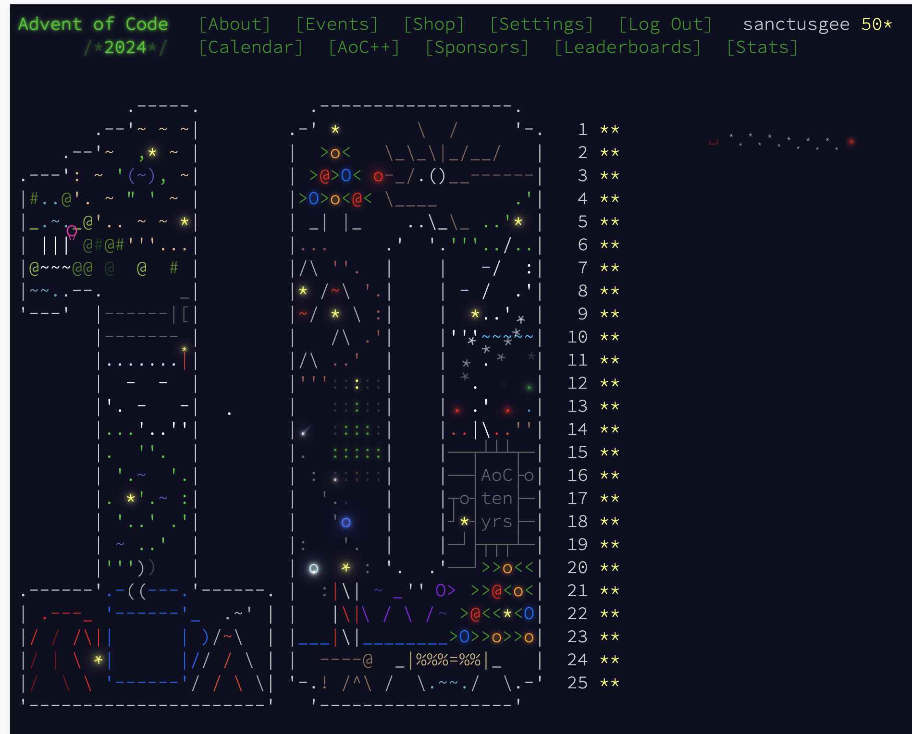

# Advent of Code 2024 Solutions - using Rust


This repository contains my [Advent of Code 2024](https://adventofcode.com/2024) solutions in **Rust**. I originally started in Python but switched to Rust after Day 5. I'd been meaning to get more serious about Rust for a while, and AoC seemed like the perfect excuse to dive deeper than just reading the Rust documentation.


## Clone the Repository

```bash
git clone https://github.com/sanctusgee/advent-of-code-solutions-rust.git
cd advent-of-code-solutions-rust
```


---
## Progress



---

## Utilities and Templates

Shared utilities (parsers, grid helpers, regex helpers, etc.) live in aoc-lib/src/utils/ and can be reused across all years.

---

## License

This project is open-sourced under the MIT License. See [LICENSE](LICENSE) for details.


